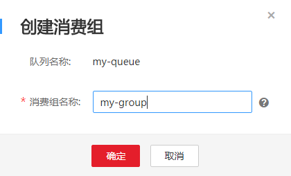
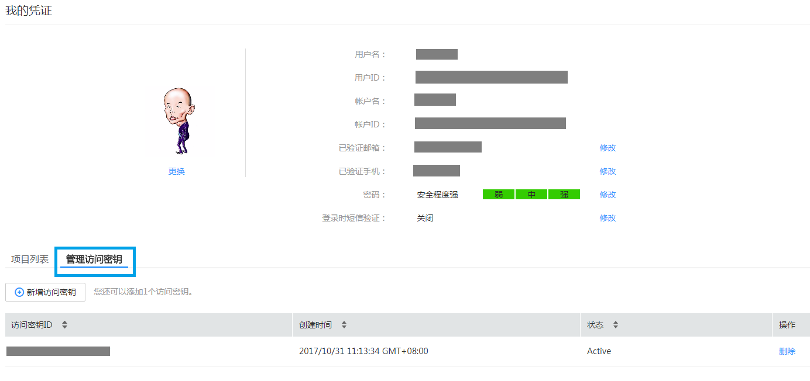

# 环境准备

## 创建普通队列

通过浏览器登录华为云，在[分布式消息服务控制台](https://console.huaweicloud.com/dms/)中创建队列，队列类型选择“普通队列”。请记录队列ID，后续访问需要使用。如果已创建过消息队列，可以跳过此步骤。

**图 1**  创建队列  

## 创建消费组

通过浏览器登录华为云，在[分布式消息服务控制台](https://console.huaweicloud.com/dms/)中选择上文创建的消息队列，为该队列创建一个消费组。请记录消费组ID，后续访问需要使用。如果已为该消息队列创建过消费组，可以跳过此步骤。

**图 2**  创建消费组  

## 创建访问密钥

通过浏览器登录华为云，选择“[我的凭证](https://console.huaweicloud.com/iam/#/myCredential)”菜单，点击“管理访问密钥”标签，新增一组访问密钥，保存credentials.csv文件到本地。从credentials.csv文件中可以提取“Access Key Id”和“Secret Access Key”。如果之前已创建过访问密钥，可以跳过此步骤。

**图 3**  管理访问秘钥  

## 获取项目ID

通过浏览器登录华为云，选择“[我的凭证](https://console.huaweicloud.com/iam/#/myCredential)”菜单，点击“项目列表”标签，根据所属区域记录对应的项目ID。

**图 4**  项目列表  

## 获取区域和Endpoint

通过浏览器访问“[地区和终端节点](http://developer.huaweicloud.com/endpoint.html)”页面，根据使用分布式消息服务RabbitMQ的实际区域，获取区域和Endpoint。

## 环境信息汇总

**表 1**  环境信息汇总

<table><thead align="left"><tr id="row1974386134714"><th class="cellrowborder" valign="top" width="23%" id="mcps1.2.4.1.1">
类型

</th>
<th class="cellrowborder" valign="top" width="22%" id="mcps1.2.4.1.2">
项目

</th>
<th class="cellrowborder" valign="top" width="55.00000000000001%" id="mcps1.2.4.1.3">
收集的信息（以下为示例，请根据实际情况替换）

</th>
</tr>
</thead>
<tbody><tr id="row27431861475"><td class="cellrowborder" rowspan="5" valign="top" width="23%" headers="mcps1.2.4.1.1 ">
分布式消息服务

</td>
<td class="cellrowborder" valign="top" width="22%" headers="mcps1.2.4.1.2 ">
队列名称

</td>
<td class="cellrowborder" valign="top" width="55.00000000000001%" headers="mcps1.2.4.1.3 ">
my-queue

</td>
</tr>
<tr id="row974486124712"><td class="cellrowborder" valign="top" headers="mcps1.2.4.1.1 ">
队列ID

</td>
<td class="cellrowborder" valign="top" headers="mcps1.2.4.1.2 ">
70054e1a-c6fc-4382-8e08-f08d91fbf86b

</td>
</tr>
<tr id="row874411624712"><td class="cellrowborder" valign="top" headers="mcps1.2.4.1.1 ">
队列类型

</td>
<td class="cellrowborder" valign="top" headers="mcps1.2.4.1.2 ">
普通队列

</td>
</tr>
<tr id="row14838250174918"><td class="cellrowborder" valign="top" headers="mcps1.2.4.1.1 ">
消费组名称

</td>
<td class="cellrowborder" valign="top" headers="mcps1.2.4.1.2 ">
my-group

</td>
</tr>
<tr id="row383910506494"><td class="cellrowborder" valign="top" headers="mcps1.2.4.1.1 ">
消费组ID

</td>
<td class="cellrowborder" valign="top" headers="mcps1.2.4.1.2 ">
g-6abc893a-4abb-4367-9d99-698bab296378

</td>
</tr>
<tr id="row98401450134912"><td class="cellrowborder" rowspan="2" valign="top" width="23%" headers="mcps1.2.4.1.1 ">
访问密钥

</td>
<td class="cellrowborder" valign="top" width="22%" headers="mcps1.2.4.1.2 ">
AK (Access Key Id)

</td>
<td class="cellrowborder" valign="top" width="55.00000000000001%" headers="mcps1.2.4.1.3 ">
********************

</td>
</tr>
<tr id="row33697367507"><td class="cellrowborder" valign="top" headers="mcps1.2.4.1.1 ">
SK (Secret Access Key）

</td>
<td class="cellrowborder" valign="top" headers="mcps1.2.4.1.2 ">
********************

</td>
</tr>
<tr id="row399310422501"><td class="cellrowborder" rowspan="3" valign="top" width="23%" headers="mcps1.2.4.1.1 ">
项目ID

</td>
<td class="cellrowborder" valign="top" width="22%" headers="mcps1.2.4.1.2 ">
所属区域

</td>
<td class="cellrowborder" valign="top" width="55.00000000000001%" headers="mcps1.2.4.1.3 ">
华北-北京一

</td>
</tr>
<tr id="row11994542205011"><td class="cellrowborder" valign="top" headers="mcps1.2.4.1.1 ">
项目

</td>
<td class="cellrowborder" valign="top" headers="mcps1.2.4.1.2 ">
cn-north-1

</td>
</tr>
<tr id="row15994104245015"><td class="cellrowborder" valign="top" headers="mcps1.2.4.1.1 ">
项目ID

</td>
<td class="cellrowborder" valign="top" headers="mcps1.2.4.1.2 ">
bd67aaead60940d688b872c31bdc663b

</td>
</tr>
<tr id="row159948421502"><td class="cellrowborder" rowspan="3" valign="top" width="23%" headers="mcps1.2.4.1.1 ">
区域和Endpoint

</td>
<td class="cellrowborder" valign="top" width="22%" headers="mcps1.2.4.1.2 ">
区域名称

</td>
<td class="cellrowborder" valign="top" width="55.00000000000001%" headers="mcps1.2.4.1.3 ">
华北-北京一

</td>
</tr>
<tr id="row10994194275010"><td class="cellrowborder" valign="top" headers="mcps1.2.4.1.1 ">
区域

</td>
<td class="cellrowborder" valign="top" headers="mcps1.2.4.1.2 ">
cn-north-1

</td>
</tr>
<tr id="row18436145495214"><td class="cellrowborder" valign="top" headers="mcps1.2.4.1.1 ">
Endpoint

</td>
<td class="cellrowborder" valign="top" headers="mcps1.2.4.1.2 ">
dms.cn-north-1.myhuaweicloud.com

</td>
</tr>
</tbody>
</table>

