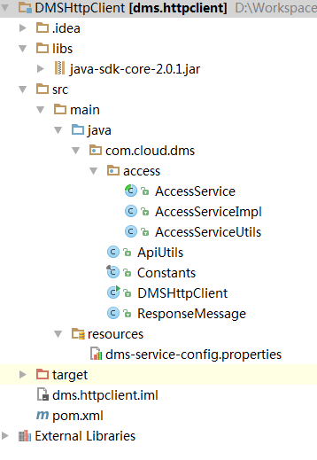

# 获取请求认证<a name="zh-cn_topic_0036212545"></a>

通过使用Access Key ID（AK）/Secret Access Key（SK）加密的方法来验证某个请求发送者身份。当您使用AK/SK认证方式完成认证鉴权时，需要通过请求签名流程获取签名并增加到业务接口请求消息头中。

> **说明：**   
>AK\(Access Key ID\)：访问密钥ID。与私有访问密钥关联的唯一标识符；访问密钥ID和私有访问密钥一起使用，对请求进行加密签名。  
>SK\(Secret Access Key\)：与访问密钥ID结合使用的密钥，对请求进行加密签名，可标识发送方，并防止请求被修改。  
>x-project-id：用户当前使用的Project ID。  

1.  生成AK/SK。如果已生成过AK/SK，则可跳过步骤1，找到原来已下载的AK/SK文件，文件名一般为：credentials.csv。
    1.  注册并登录管理控制台。
    2.  单击用户名，在下拉列表中单击“我的凭证”。

    1.  单击“管理访问密钥”。
    2.  单击“新增访问密钥”，进入“新增访问密钥”页面。
    3.  输入登录密码和短信验证码，单击“确定”，下载密钥，请妥善保管。

2.  <a name="li17137133433914"></a>工程中引入API网关签名SDK。
    1.  下载API网关签名工具。

        下载地址：[http://esdk.huawei.com/ilink/esdk/download/HW\_456706](http://esdk.huawei.com/ilink/esdk/download/HW_456706)。

    2.  解压下载的压缩包，得到jar文件。
    3.  将解压出来的所有jar文件引用到依赖路径中。如[图1](#fig18857107192010)所示。

        **图 1**  引用jar文件<a name="fig18857107192010"></a>  
        


3.  对请求进行签名。

    签名方法集成在[步骤2](#li17137133433914)引入的jar文件中。发送请求前，需要对请求内容进行签名，得到的签名结果将作为http头部信息一起发送。

    签名过程如下：

    1.  创建用于签名的请求com.cloud.sdk.DefaultRequest\(JAVA\)。
    2.  设置DefaultRequest的目标API URL、HTTPS方法、内容等信息。
    3.  对DefaultRequest进行签名：
        1.  调用SignerFactory.getSigner\(String serviceName, String regionName\)获取一个签名工具实现的实例。
        2.  调用Signer.sign\(Request<?\> request, Credentials credentials\)对创建的请求进行签名。

            以下代码展示了这个步骤：

            ```
             //选用签名算法，对请求进行签名
            Signer signer = SignerFactory.getSigner(serviceName, region);
            //对请求进行签名，request会发生改变
            signer.sign(request, new BasicCredentials(this.ak, this.sk));
            ```


    4.  把上步中签名产生的request转换为一个适合发送的请求，并将签名后request中的header信息放入新的request中。

        以Apache HttpClient为例，需要把DefaultRequest转换为HttpRequestBase，把签名后的DefaultRequest的header信息放入HttpRequestBase中。

        具体过程请查看代码示例包中的AccessServiceImpl.java。

        代码示例包下载方法如下：

        1.  登录管理控制台。
        2.  在消息服务的页面上，选择“API使用向导”。
        3.  在左侧选择“REST API”。
        4.  在页面右侧，单击“示例代码下载”可下载代码包。

        代码结构如[图2](#fig21198599145139)所示。

        **图 2**  代码结构<a name="fig21198599145139"></a>  
        

        AccessService：抽象类，将GET/POST/PUT/DELETE归一成access方法。

        AccessServiceImpl：实现access方法，具体与DMS网关通信的代码都在access方法中

        AccessServiceUtils：工具类，GET/POST/PUT/DELETE实现方法和返回结果的解析方法。

        ApiUtils：DMS API业务工具类，负责构造API URI、解析API返回内容。

        DMSHttpClient：运行入口，模拟用户进行GET/POST/PUT/DELETE请求。

        Constants：定义常量的类，所有的常量都在这个类里面定义。

        ResponseMessage：HTTP返回结果对象，包含success、body、statusCode三个字段信息

        dms-service-config.properties：包含DMS网关签名需要的service name、region、AK、SK和DMS endpoint。


