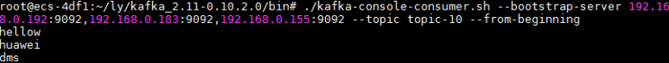

# SASL方式连接Kafka专享版实例<a name="dms-ug-180801001"></a>

创建实例时开启SASL\_SSL访问，则数据加密传输，安全性更高。

本节介绍如何使用开源的Java客户端在同一VPC内访问开启SASL的Kafka专享实例的方法。

> **说明：**   
>当使用开源接口生产和消费消息时，如果域名解析不通，建议配置host和IP的映射关系，否则可能会引入时延。  
>例如：  
>10.154.48.120 server01  
>10.154.48.121 server02  
>10.154.48.122 server03  

## 前提条件<a name="section17830048113810"></a>

已创建Kafka专享版实例，并记录创建完成后，实例详情中的“连接地址”。

已创建弹性云服务器，并且VPC、子网、安全组与Kafka专享版实例的VPC、子网、安全组保持一致。

## 命令行模式连接实例<a name="section189213202426"></a>

1.  下载client.truststore.jks证书。

    下载地址：[http://static.huaweicloud.com/upload/files/dms/dmskafkasasl.zip](http://static.huaweicloud.com/upload/files/dms/dmskafkasasl.zip)，下载压缩包后解压，目录如下：

    -   client.truststore.jks：客户端证书
    -   dms.kafka.sasl.client-1.0.0.jar： SASL包
    -   dms\_kafka\_client\_jaas.conf：客户端配置文件

2.  登录弹性云服务器。

    > **说明：**   
    >弹性云服务器必须与Kafka专享实例处于相同VPC、子网与安全组。  

3.  安装Java JDK或JRE，并配置JAVA\_HOME与PATH环境变量，使用执行用户在用户家目录下修改.bash\_profile，添加如下行。

    ```
    export JAVA_HOME=/opt/java/jdk1.8.0_151 
    export PATH=$JAVA_HOME/bin:$PATH
    ```

    执行source .bash\_profile命令使修改生效。

    > **说明：**   
    >ECS虚拟机默认自带的JDK可能不符合要求，例如OpenJDK，需要配置为Oracle的JDK，可至[Oracle官方下载页面](http://www.oracle.com/technetwork/java/javase/downloads/index.html)下载Java Development Kit 1.8.111及以上版本。  

4.  下载开源的Kafka客户端。

    对应0.10.2\_plus版本实例的下载地址：[https://archive.apache.org/dist/kafka/0.10.2.0/kafka\_2.11-0.10.2.0.tgz](https://archive.apache.org/dist/kafka/0.10.2.0/kafka_2.11-0.10.2.0.tgz)

    对应1.1.0版本实例的下载地址：[http://mirrors.tuna.tsinghua.edu.cn/apache/kafka/1.1.0/kafka\_2.11-1.1.0.tgz](http://mirrors.tuna.tsinghua.edu.cn/apache/kafka/1.1.0/kafka_2.11-1.1.0.tgz)

5.  解压Kafka客户端文件，下面以0.10.2.0版本为例。

    **tar -zxf  _\[kafka\_tar\]_**

6.  在consumer.properties/producer.properties文件中增加如下行：

    ```
    sasl.jaas.config=org.apache.kafka.common.security.plain.PlainLoginModule required \
    username="**********" \
    password="**********";        
    sasl.mechanism=PLAIN
    
    security.protocol=SASL_SSL
    ssl.truststore.location=/opt/kafka_2.11-1.1.0/config/client.truststore.jks
    ssl.truststore.password=********
    ```

    说明：其中username和password为创建Kafka专享实例时开启SASL\_SSL时填入的账户和密码， ssl.trustore.location配置为证书的存放路径。

7.  进入\[base\_dir\]/kafka\_2.11-0.10.2.0/bin目录下。
8.  执行如下命令进行生产消息。

    **./kafka-console-producer.sh --broker-list \[连接地址\] --topic \[Topic名称\] --producer.config ../config/producer.properties**

    执行完命令后输入内容，按回车键发送消息到Kafka实例，输入的每一行内容都将作为一条消息发送到Kafka实例。

    下图Kafka实例连接地址以“192.168.0.192:9092,192.168.0.183:9092,192.168.0.155:9092”为例，3个IP表示有3个Broker。

    **图 1**  生产消息<a name="fig174635218315"></a>  
    

    如需停止生产使用Ctrl+C命令退出。

9.  执行如下命令消费消息。

    **./kafka-console-consumer.sh --bootstrap-server \[连接地址\] --topic \[Topic名称\] --from-beginning  --**consumer**.config ../config/**consumer**.properties**

    下图Kafka实例连接地址以“192.168.0.192:9092,192.168.0.183:9092,192.168.0.155:9092”为例，3个IP表示有3个Broker。

    **图 2**  消费消息<a name="fig161838173112"></a>  
    

    如需停止消费使用Ctrl+C命令退出。


