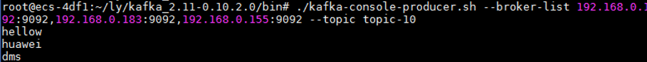

# 连接Kafka专享版实例<a name="dms-ug-180604020"></a>

目前，DMS提供Kafka专享版实例的服务，Kafka专享版实例采用物理隔离的方式部署，租户独占Kafka实例。创建Kafka专享版实例之后，使用开源Kafka客户端向Kafka专享版实例生产消息和消费消息。

本节介绍使用开源的Java客户端在同一VPC内访问与使用Kafka专享实例的方法。多语言客户端的使用请参考Kafka官网：[https://cwiki.apache.org/confluence/display/KAFKA/Clients](https://cwiki.apache.md)

## 前提条件<a name="section17830048113810"></a>

已创建Kafka专享版实例，并记录创建完成后，实例详情中的“连接地址”。

已创建弹性云服务器，并且VPC、子网、安全组与Kafka专享版实例的VPC、子网、安全组保持一致。

## 命令行模式连接实例<a name="section189213202426"></a>

1.  登录弹性云服务器。

    > **说明：**   
    >弹性云服务器必须与Kafka专享实例处于相同VPC、子网与安全组。  

2.  安装Java JDK或JRE，并配置JAVA\_HOME与PATH环境变量，使用执行用户在用户家目录下修改.bash\_profile，添加如下行。

    ```
    export JAVA_HOME=/opt/java/jdk1.8.0_151 
    export PATH=$JAVA_HOME/bin:$PATH
    ```

    执行source .bash\_profile命令使修改生效。

    > **说明：**   
    >ECS虚拟机默认自带的JDK可能不符合要求，例如OpenJDK，需要配置为Oracle的JDK，可至[Oracle官方下载页面](http://www.oracle.com/technetwork/java/javase/downloads/index.html)下载Java Development Kit 1.8.111及以上版本。  

3.  下载开源的Kafka客户端。

    对应0.10.2\_plus版本实例的下载地址：[https://archive.apache.org/dist/kafka/0.10.2.0/kafka\_2.11-0.10.2.0.tgz](https://archive.apache.org/dist/kafka/0.10.2.0/kafka_2.11-0.10.2.0.tgz)

    对应1.1.0版本实例的下载地址：[http://mirrors.tuna.tsinghua.edu.cn/apache/kafka/1.1.0/kafka\_2.11-1.1.0.tgz](http://mirrors.tuna.tsinghua.edu.cn/apache/kafka/1.1.0/kafka_2.11-1.1.0.tgz)

4.  解压Kafka客户端文件，下面以0.10.2.0版本为例。

    **tar -zxf  _\[kafka\_tar\]_**

5.  进入\[base\_dir\]/kafka\_2.11-0.10.2.0/bin目录下。
6.  执行如下命令进行生产消息。

    **_./kafka-console-producer.sh --broker-list \[连接地址\] --topic \[Topic名称\]_**

    执行完命令后输入内容，按回车键发送消息到Kafka实例，输入的每一行内容都将作为一条消息发送到Kafka实例。

    下图Kafka实例连接地址以“192.168.0.192:9092,192.168.0.183:9092,192.168.0.155:9092”为例，3个IP表示有3个Broker。

    **图 1**  Kafka专享版生产消息<a name="fig1125032512301"></a>  
    

    如需停止生产使用Ctrl+C命令退出。

7.  执行如下命令消费消息。

    _**./kafka-console-consumer.sh --bootstrap-server \[连接地址\] --topic \[Topic名称\] --from-beginning**_

    下图Kafka实例连接地址以“192.168.0.192:9092,192.168.0.183:9092,192.168.0.155:9092”为例，3个IP表示有3个Broker。

    **图 2**  Kafka专享版消费消息<a name="fig16636329305"></a>  
    

    如需停止消费使用Ctrl+C命令退出。


